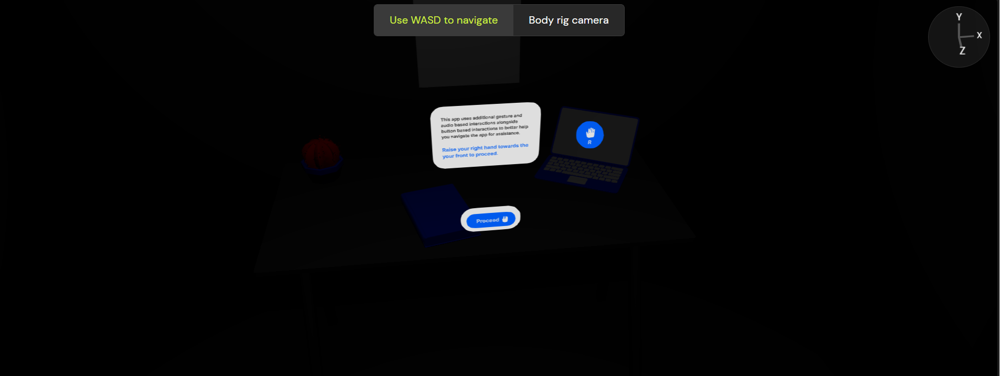

# Xplore
Virtual Companion for Guided Experiences | XR Design Challenge
# Xplore - Revolutionizing Spatial Design with XR and AI


## 🌟 Overview

**Xplore** is a cutting-edge application that integrates the power of Meta LLaMA, IDEO's human-centered design principles, and ShapesXR to create an innovative platform for XR (Extended Reality) experiences. This project bridges AI-driven adaptability, immersive prototyping, and user-first interaction, shaping the future of XR design.

---

## 🎥 Demo

Check out the demo video to see **Xplore** in action!  
[

---

## 📸 Screenshots

### Home Screen


### Design Prototyping


### Immersive Navigation


---

## 🚀 Features

- **AI-Driven Interaction**: Leverages Meta LLaMA for intelligent and context-aware XR interfaces.
- **Real-Time Prototyping**: ShapesXR enables seamless and immersive prototyping of XR designs.
- **User-Centered Design**: IDEO’s design principles ensure an intuitive and accessible user experience.
- **Multi-Platform Support**: Compatible with Quest 3, Android Phones, and PCVR platforms.
- **Dynamic Use Cases**: Applications include education, gaming, productivity, and more.

---

## 🛠️ Built With

- **Languages**: Kotlin, Python
- **Frameworks**: Jetpack Compose, FastAPI
- **Tools**: ShapesXR, Meta LLaMA
- **Cloud Services**: AWS, Firebase
- **Platforms**: Android, PCVR, Quest 3

---

## 📂 Project Structure

```plaintext
Xplore/
├── app/
│   ├── src/
│   │   ├── main/
│   │   │   ├── Home.kt            # Main activity
│   │   │   ├── DetailActivity.kt  # Detail activity for XR designs
│   │   │   └── ...                # Other Kotlin files
│   └── res/
│       ├── drawable/              # Images and icons
│       ├── layout/                # XML layouts
│       └── values/                # Colors, strings, etc.
├── backend/
│   ├── main.py                    # FastAPI backend
│   ├── requirements.txt           # Backend dependencies
│   └── ...                        # Other backend files
├── README.md                      # Project documentation
├── LICENSE                        # Project license
└── media/
    ├── 1.jpg                      # Logo
    ├── 2.jpg                      # Home screen
    ├── 3.jpg                      # Prototyping screenshot
    ├── 4.jpg                      # Immersive navigation
    └── video.mp4                  # Demo video
```

## 📝 Installation
``` 
Prerequisites
Android Studio for mobile development
Python 3.9+ for the backend
Firebase or AWS setup for cloud integration
```

## Clone the repository:

git clone https://github.com/SohaibAamir28/Xplore.git
cd Xplore

## Setup Backend:

python -m venv venv
source venv/bin/activate  # For Windows: venv\Scripts\activate
pip install -r requirements.txt
uvicorn main:app --reload

## Setup Frontend:

Open the app folder in Android Studio.
Build and run the project on an emulator or connected device.
Connect Backend to Firebase:

### Add your Firebase credentials to the backend configuration.
## 📚 Usage
Home Screen: Browse XR designs and select one for detailed views.
Prototyping: Use ShapesXR to create real-time immersive designs.
AI-Driven Navigation: Interact with the app using voice commands powered by Meta LLaMA.
## 🌍 Supported Platforms
Quest 3: VR headset
Android Phones: Mobile devices
PCVR: PC-based VR systems

## 🤝 Contributors
Sohaib Aamir ([GitHub](https://github.com/SohaibAamir28))
Open to more contributors! Fork and submit a PR.
📜 License
This project is licensed under the MIT License - see the LICENSE file for details.

💡 Acknowledgements
Meta: For the LLaMA AI model.
IDEO: For their human-centered design principles.
ShapesXR: For immersive prototyping capabilities.
Devpost: For hosting the XR Design Challenge.
🌟 Get Involved
Have ideas or feedback? Open an issue or reach out via email at sohaibaamir28@example.com.

Let’s shape the future of XR design together!

🔗 Links
YouTube Demo  ([Xplore Demo](https://youtube.com/shorts/R9dDd1Rz54s?feature=share))
GitHub Repository ([Xplore Repo](https://github.com/SohaibAamir28/Xplore))
Devpost Page ([Xplore Devpost Page](https://devpost.com/software/virtual-companion-for-guided-experiences))
